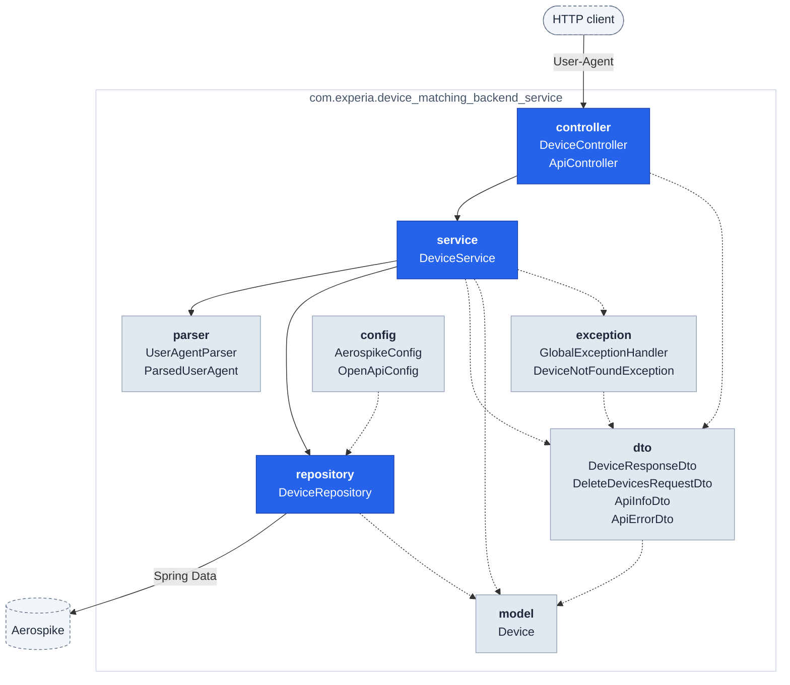

# Device Matching Backend Service

A Spring Boot REST API that identifies a device from the client's **User-Agent** string.

The service parses the User-Agent, extracts four characteristics — **operating system name, OS
version, browser name, browser version** — and looks for a stored device profile with the same
four. If one exists its hit count is incremented; if none exists a new profile is created. On top
of that it offers lookup, search and deletion of the stored profiles.

Device profiles are stored in **Aerospike**, a key-value database.

---

## Contents

- [What the service does](#what-the-service-does)
- [Technologies](#technologies)
- [Prerequisites](#prerequisites)
- [Running the project](#running-the-project)
- [API reference](#api-reference)
- [Configuration](#configuration)
- [Project structure](#project-structure)
- [Design decisions](#design-decisions)
- [Testing](#testing)

---

## What the service does

Each stored device profile holds exactly the information the assignment asks for:

| Field | Meaning |
|---|---|
| `deviceId` | Unique device identifier |
| `hitCount` | How many times this device has been seen |
| `osName` | Operating system name, e.g. `Mac OS`, `Windows NT` |
| `osVersion` | Operating system version |
| `browserName` | Browser name, e.g. `Chrome`, `Firefox` |
| `browserVersion` | Browser version |


## Technologies

| Technology | Purpose |
|---|---|
| Java 21 | Language |
| Spring Boot 4.1 | Application framework |
| Spring Data Aerospike | Repositories and object mapping |
| Aerospike 8.x Community | Database |
| YAUAA | User-Agent parsing |
| springdoc-openapi | OpenAPI document and Swagger UI |
| Maven | Build tool |
| JUnit 5 + Mockito | Unit tests |

---

## Prerequisites

| Requirement | Version | Needed for |
|---|---|---|
| JDK | 21+ | Building and running |
| Maven | 3.9+ | Building (or use the bundled `./mvnw`) |
| Docker | any recent | Running Aerospike |

---

## Running the project

### 1. Start Aerospike

```bash
docker run -d \
  --name aerospike \
  --restart unless-stopped \
  -p 3000:3000 \
  aerospike/aerospike-server:8.1.2.4
```

Check that it is up:

```bash
docker ps
```

The image starts with a default namespace called `test`, which is what the application expects.

### 2. Start the application

```bash
./mvnw spring-boot:run
```

Or build a jar and run it:

```bash
./mvnw clean package
java -jar target/device-matching-backend-service-0.0.1-SNAPSHOT.jar
```

The service listens on **http://localhost:8080**.

### 3. Check that it works

```bash
curl http://localhost:8080/api
```

```json
{"appName":"Device Matching Service","appVersion":"1.0.0","currentTime":"2026-08-03T22:56:56"}
```

---

## API reference

| Method | Path | Purpose |
|---|---|---|
| `POST` | `/devices/match` | Match or create a device from the `User-Agent` header |
| `GET` | `/devices/{id}` | Get one device profile |
| `GET` | `/devices?osName=…` | List every device on one operating system |
| `DELETE` | `/devices/{id}` | Delete one device profile |
| `DELETE` | `/devices` | Delete several device profiles |
| `GET` | `/api` | Service name, version and time |

### Match or create a device

Reads the `User-Agent` **header** — browsers and HTTP clients send it automatically. Override it
with `-H` to test a specific device.

```bash
curl -X POST http://localhost:8080/devices/match \
  -H 'User-Agent: Mozilla/5.0 (Macintosh; Intel Mac OS X 10_15_7) AppleWebKit/537.36 (KHTML, like Gecko) Chrome/125.0.0.0 Safari/537.36'
```

```json
{
  "deviceId": "81d812d4-a694-41b1-8e64-3665a3341148",
  "hitCount": 1,
  "osName": "Mac OS",
  "osVersion": ">=10.15.7",
  "browserName": "Chrome",
  "browserVersion": "125"
}
```

Repeat the same request and `hitCount` becomes `2`, with the same `deviceId`.

### Get a device by id

```bash
curl http://localhost:8080/devices/81d812d4-a694-41b1-8e64-3665a3341148
```

An unknown id returns `404`:

```json
{
  "timestamp": "2026-08-03T22:56:56.858275",
  "status": 404,
  "error": "Not Found",
  "message": "No device with that ID"
}
```

### List devices by operating system

```bash
curl 'http://localhost:8080/devices?osName=Mac%20OS'
```

Returns an array of profiles, or `[]` when nothing matches. Omitting `osName` returns `400`.

### Delete a single device

```bash
curl -X DELETE http://localhost:8080/devices/81d812d4-a694-41b1-8e64-3665a3341148
```

Returns `204 No Content`, or `404` if that id is not stored.

### Delete several devices

Takes a JSON object with a `deviceIds` array:

```bash
curl -X DELETE http://localhost:8080/devices \
  -H 'Content-Type: application/json' \
  -d '{"deviceIds": ["81d812d4-a694-41b1-8e64-3665a3341148", "b0f2c1e4-1a2b-3c4d-5e6f-708192a3b4c5"]}'
```

Returns `204 No Content`. The request is **all-or-nothing**: it is rejected with `400` when the
list is empty, contains duplicates, or names an id that is not stored — and in that case nothing
is deleted.

### Error format

Every error is produced by a single `@RestControllerAdvice` and has the same shape:

| Situation | Status |
|---|---|
| Device not found | `404 Not Found` |
| Invalid request data | `400 Bad Request` |
| Unexpected server error | `500 Internal Server Error` |

```json
{
  "timestamp": "2026-08-03T15:30:00",
  "status": 404,
  "error": "Not Found",
  "message": "No device with that ID"
}
```

---


## Configuration

Settings live in `src/main/resources/application.properties`:

```properties
spring.application.name=Device Matching Service
app.version=1.0.0

aerospike.host=localhost
aerospike.port=3000
aerospike.namespace=test
```

| Property | Default | Meaning |
|---|---|---|
| `aerospike.host` | `localhost` | Aerospike hostname |
| `aerospike.port` | `3000` | Aerospike client port |
| `aerospike.namespace` | `test` | Namespace the profiles are stored in |
| `server.port` | `8080` | HTTP port |

The three `aerospike.*` properties are read by `config/AerospikeConfig.java`, which extends
`AbstractAerospikeDataConfiguration` and hands them to the Aerospike client.

Any of them can be overridden without editing the file:

```bash
java -jar target/device-matching-backend-service-0.0.1-SNAPSHOT.jar \
  --aerospike.host=db1 --aerospike.port=3000 --server.port=9090
```

---

## Project structure

### Package dependencies



Solid arrows are the request path; dotted arrows mean "uses types from". The three blue packages
are the layers a request travels through — **controller → service → repository** — and nothing
points back up.

### Files

```
src/main/java/com/experia/device_matching_backend_service
├── DeviceMatchingBackendServiceApplication   entry point
├── config/                                   configuration
│   ├── AerospikeConfig                           Aerospike connection + repository scanning
│   └── OpenApiConfig                             API title, version, description
├── controller/                               REST endpoints
│   ├── DeviceController
│   └── ApiController
├── service/                                  business logic
│   └── DeviceService
├── repository/                               persistence
│   └── DeviceRepository
├── model/                                    stored entity
│   └── Device
├── parser/                                   User-Agent parsing
│   ├── UserAgentParser
│   └── ParsedUserAgent
├── dto/                                      request and response payloads
│   ├── DeviceResponseDto
│   ├── DeleteDevicesRequestDto
│   ├── ApiInfoDto
│   └── ApiErrorDto
└── exception/                                error handling
    ├── DeviceNotFoundException
    └── GlobalExceptionHandler
```

Requests flow in one direction: **controller → service → repository**.

---

## Design decisions

- **DTOs are returned instead of entities**, so the stored shape can change without breaking the
  API.
- **Constructor injection** everywhere, which keeps dependencies explicit and classes testable.
- **Business logic lives in the service layer**; controllers only translate HTTP to method calls.
- **User-Agent parsing is delegated to YAUAA** rather than hand-written regexes. User-Agent strings
  are deliberately misleading — every browser claims to be several others — and a maintained rule
  set handles that far better than a regex ever will.
- **Validation happens before touching the database** wherever possible.
- **Bulk deletion is all-or-nothing**, so a half-applied delete can never happen.
- **Custom exceptions plus one global handler** give every error the same JSON shape.
- **The OS name bin carries a secondary index** (`@Indexed` on `Device.osName`), so listing devices
  by operating system is an indexed query rather than a full scan.

---

## Testing

```bash
./mvnw test
```

Unit tests for the service layer, written with **JUnit 5** and **Mockito**. They need nothing but
a JVM — no database has to be running.

| Test | What it covers |
|---|---|
| `service/DeviceServiceTest` | Business logic with a mocked repository and parser — matching an existing device, creating a new one, lookup by id, search by operating system, single and bulk deletion, and every validation rule |
| `parser/UserAgentParserTest` | Real User-Agent strings across Windows, macOS, Linux and Android |

